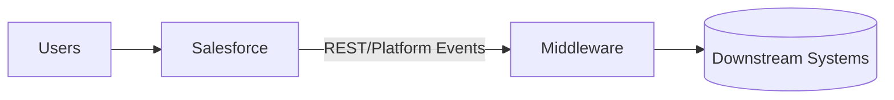

# Project Overview

> **This is a template.** Replace every `[bracketed]` placeholder with your project's reality.

---

## Program at a glance

| Field                | Value                                                        |
| -------------------- | ------------------------------------------------------------ |
| Program name         | `[Your Program Name]`                                        |
| Sponsor / Exec owner | `[Name, Role]`                                               |
| Salesforce org(s)    | `[Production / Full Sandbox / Partial / Dev]`                |
| Primary cloud(s)     | `[Sales / Service / Industries / Health / Marketing / etc.]` |
| Managed packages     | `[List]`                                                     |
| Delivery model       | `[Internal / Vendor-led / Hybrid]`                           |
| Methodology          | `[Scrum / SAFe / Kanban]`                                    |
| Sprint length        | `[2 weeks]`                                                  |
| Tooling              | `JIRA, [Copado / Gearset / Flosum], Cursor, Salesforce DX`   |

## Business context

`[2–3 paragraphs: what business problem this Salesforce program solves, who the users are, what success looks like in plain English. Avoid jargon — a new hire should understand.]`

## In scope

- `[Capability 1]`
- `[Capability 2]`
- `[Capability 3]`

## Out of scope

- `[Explicit non-goal 1]`
- `[Explicit non-goal 2]`

---

## Architecture summary

`[1 paragraph + a Mermaid diagram if helpful. Detailed ADRs go under knowledge/architecture/ as ADR-001-*.md, ADR-002-*.md, etc.]`

## Key integrations

| System             | Direction      | Pattern             | Owner    |
| ------------------ | -------------- | ------------------- | -------- |
| `[ERP]`            | Outbound       | Platform Event → MQ | `[Team]` |
| `[Data warehouse]` | Outbound batch | Bulk API 2.0        | `[Team]` |

---

## Teams & RACI

| Role                | Person   | Responsibilities                       |
| ------------------- | -------- | -------------------------------------- |
| Solution Architect  | `[Name]` | Cross-sprint consistency, AC review    |
| Technical Architect | `[Name]` | Component design, deep impact analysis |
| Lead Developer      | `[Name]` | Implementation in code repo            |
| QA Lead             | `[Name]` | Test strategy, regression coverage     |
| Product Owner       | `[Name]` | Backlog priority, AC ownership         |

---

## Where things live

| Asset                                      | Location                                             |
| ------------------------------------------ | ---------------------------------------------------- |
| Requirements (this workspace)              | this folder                                          |
| Salesforce metadata (Apex, Flows, Objects) | `[Git URL of your DX repo]`                          |
| Deployments / pipelines                    | `[Copado / Gearset / GH Actions URL]`                |
| Backlog & boards                           | `[JIRA URL]`                                         |
| Org access                                 | `[Identity provider / request process]`              |
| Diagrams / wireframes                      | `artifacts/diagrams/` here, or `[Lucid / Figma URL]` |

---

## Workspace ground rules (v2)

1. **Plan & Ask only** — the AI will never write production code, never offer to switch to build mode, never ask "should I implement this?". See `_cursor/rules/plan-and-ask-only.mdc`.
2. **Metadata wins on current state** — when `/knowledge/metadata/` disagrees with JIRA Solution about what exists today, the metadata is right. See `_cursor/rules/metadata-is-source-of-truth.mdc`.
3. **Never paste production data** (PII, customer records, secrets) into any file.
4. **Story IDs are the lingua franca** — every solution, ADR, and diagram cites the story it traces to.
5. **Indexes are generated** — never hand-edit `knowledge/AC-INDEX.md` etc.; rerun the scripts.
6. **Code does not live here** — link out to the DX repo by file path + commit SHA.
7. **Use Plan or Ask mode only** — Agent mode is intentionally minimized; the rules block code generation in all modes.

