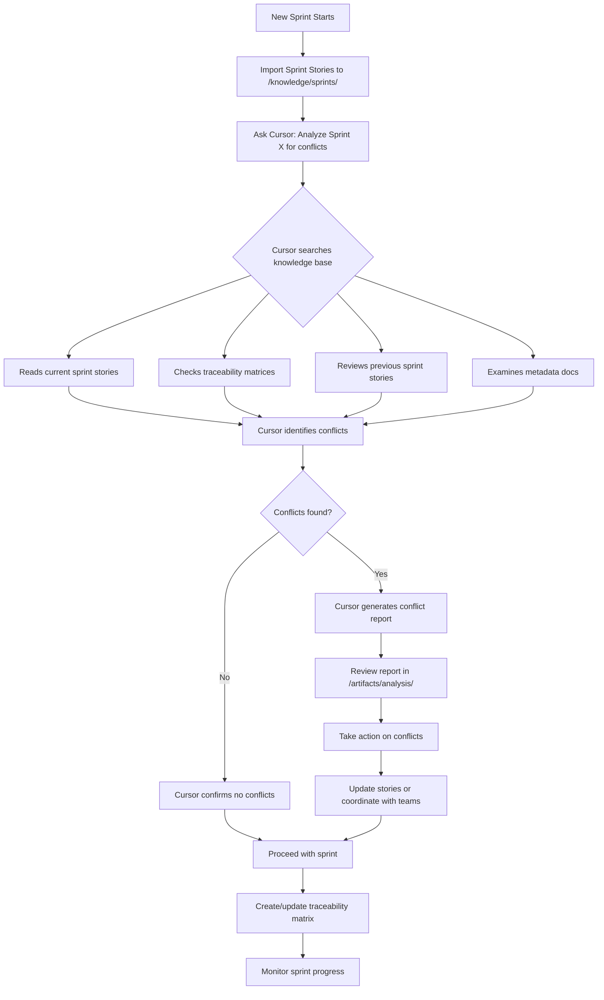
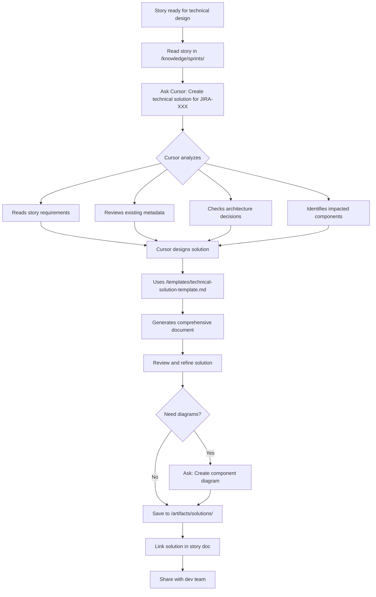
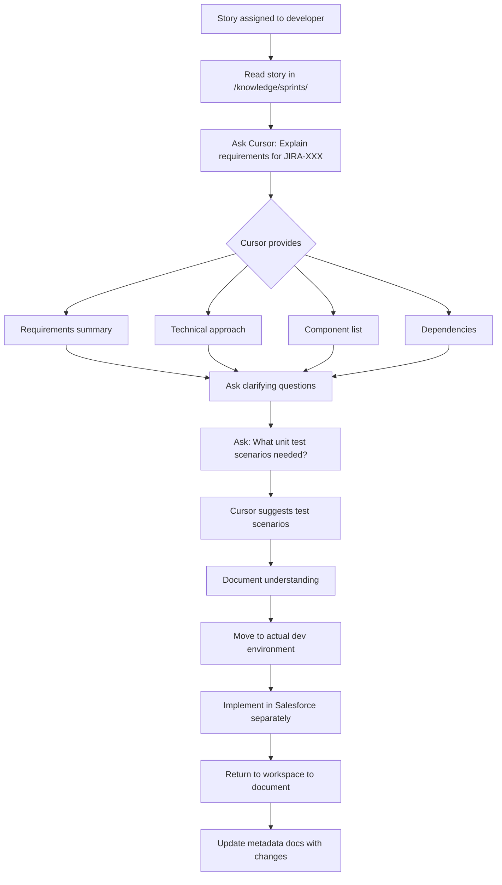
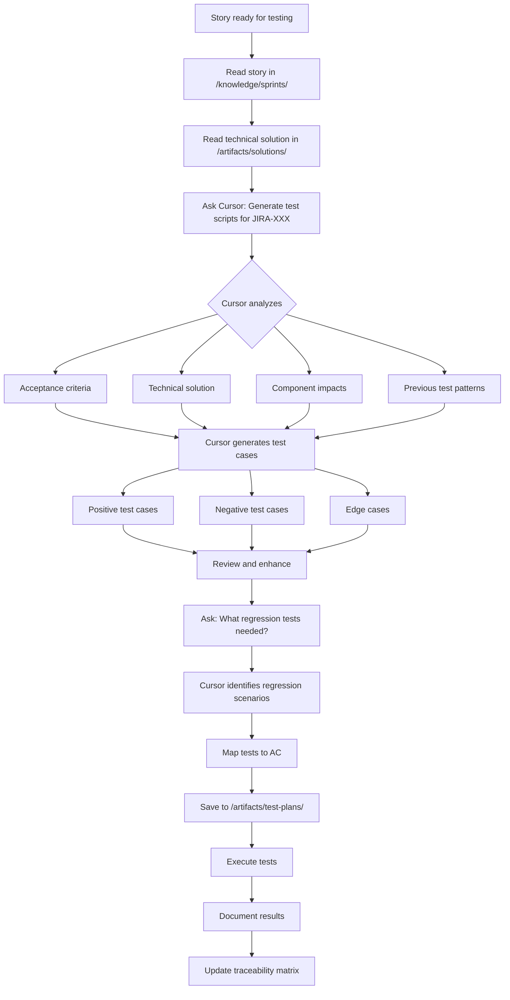

# Workflow Guide - Visual Process Flows

This guide shows visual workflows for each role using the Cursor workspace.

---

## 🔄 Solution Architect Workflow

### Sprint Conflict Detection Flow




### Acceptance Criteria Validation

```
1. Select story to validate
   ↓
2. Ask: "Review AC for JIRA-XXX against existing metadata"
   ↓
3. Cursor reads:
   - Story AC
   - Current component state (metadata docs)
   - Related stories
   - Technical constraints
   ↓
4. Cursor reports:
   - AC feasibility
   - Missing dependencies
   - Risks to deliverability
   ↓
5. Provide confidence assessment
   ↓
6. Update story or request clarifications
```

---

## 🏗️ Technical Architect Workflow

### Technical Solution Design Flow




### Component Impact Analysis

```
1. Identify story for analysis
   ↓
2. Ask: "List all components impacted by JIRA-XXX"
   ↓
3. Cursor searches:
   - Story description
   - Related metadata
   - Traceability matrices
   - Previous similar stories
   ↓
4. Cursor generates impact list:
   - Direct impacts (modified components)
   - Indirect impacts (dependent components)
   - Integration impacts
   - Data model impacts
   - Security impacts
   ↓
5. Review impact analysis
   ↓
6. Update technical solution with impacts
   ↓
7. Estimate effort and risk
```

---

## 💻 Developer Workflow

### Implementation Planning Flow




### Understanding Requirements

```
Developer flow (no code in workspace):

1. Story assigned
   ↓
2. Ask: "What do I need to know for JIRA-XXX?"
   ↓
3. Cursor provides:
   - Acceptance criteria explained
   - Technical solution reference
   - Component modifications needed
   - Dependencies to be aware of
   - Integration points
   ↓
4. Ask follow-up questions:
   - "What's the recommended approach?"
   - "What existing metadata should I reference?"
   - "What edge cases exist?"
   ↓
5. Plan unit testing:
   Ask: "What test scenarios for JIRA-XXX?"
   ↓
6. Move to Salesforce dev environment
   ↓
7. Implement (outside this workspace)
   ↓
8. Return to update documentation
```

---

## 🧪 Tester Workflow

### Test Script Creation Flow




### Regression Testing Planning

```
1. Identify story with component changes
   ↓
2. Ask: "What regression testing for JIRA-XXX?"
   ↓
3. Cursor analyzes:
   - Components modified
   - Previous stories on same components
   - Dependent functionality
   - Integration points
   ↓
4. Cursor suggests:
   - Existing test cases to re-run
   - New scenarios for regression
   - Risk areas to focus on
   ↓
5. Create regression test suite
   ↓
6. Link to story and components
   ↓
7. Execute and document
```

---

## 🔄 Cross-Role Collaboration Flow

### Complete Sprint Cycle

```mermaid
graph LR
    A[Sprint Planning] --> B[Solution Architect]
    B -->|Conflict Analysis| C[Stories Validated]
    C --> D[Technical Architect]
    D -->|Solution Design| E[Solutions Created]
    E --> F[Developer]
    F -->|Implementation Q&A| G[Code Written Externally]
    G --> H[Tester]
    H -->|Test Scripts| I[Testing Complete]
    I --> J[Solution Architect]
    J -->|Sprint Review| K[Update Documentation]
    K --> L[Update Traceability]
    L --> M[Sprint Complete]
    M --> A
```




### Information Flow Through Workspace

```
JIRA Stories → /knowledge/sprints/
       ↓
Solution Architect analyzes
       ↓
Technical Architect designs → /artifacts/solutions/
       ↓
Developer references (implements externally)
       ↓
Updates metadata docs → /knowledge/metadata/
       ↓
Tester creates scripts → /artifacts/test-plans/
       ↓
All linked in → /knowledge/traceability/
       ↓
Next sprint references this knowledge
```

---

## 📊 Data Flow Diagram

### How Knowledge Flows Through the Workspace

```
Input Sources:
├─ JIRA (stories, requirements, AC)
├─ Copado (deployment tracking)
└─ Salesforce Org (metadata export)
       ↓
Knowledge Base (/knowledge/)
├─ /sprints/ (requirements)
├─ /metadata/ (current state)
├─ /traceability/ (connections)
└─ /architecture/ (decisions)
       ↓
Cursor AI Analysis
├─ Search & retrieve
├─ Cross-reference
├─ Identify conflicts
└─ Generate insights
       ↓
Artifacts Created (/artifacts/)
├─ /solutions/ (designs)
├─ /diagrams/ (visualizations)
├─ /test-plans/ (test scripts)
└─ /analysis/ (reports)
       ↓
Outputs:
├─ Informed decisions
├─ Complete documentation
├─ Reduced conflicts
└─ Better quality
```

---

## 🎯 Decision Trees

### When to Use This Workspace vs. Other Tools

```
Question about requirements or dependencies?
├─ YES → Use this workspace (Ask Cursor)
└─ NO → Continue below

Need to write actual code?
├─ YES → Use Salesforce dev environment (NOT this workspace)
└─ NO → Continue below

Need to design a solution?
├─ YES → Use this workspace (Ask Cursor, Plan mode)
└─ NO → Continue below

Need to create test scripts?
├─ YES → Use this workspace (Ask Cursor)
└─ NO → Continue below

Need to analyze conflicts?
├─ YES → Use this workspace (Ask Cursor)
└─ NO → Continue below

Need to deploy metadata?
├─ YES → Use Copado/SFDX (NOT this workspace)
└─ NO → This workspace may not be needed
```

### Which Mode to Use in Cursor

```
Clear, specific question?
├─ YES → Use Ask Mode
└─ NO → Continue below

Need to explore multiple approaches?
├─ YES → Use Plan Mode
└─ NO → Continue below

Need to write code?
├─ YES → DON'T use this workspace
└─ NO → Use Ask Mode for documentation
```

---

## ⏱️ Typical Time Estimates

### Solution Architect Tasks

- Import sprint stories: 15-30 min
- Run conflict analysis: 2-5 min (with Cursor)
- Review and document conflicts: 10-20 min
- Create traceability matrix: 20-30 min
- Validate AC: 5-10 min per story

### Technical Architect Tasks

- Create technical solution: 30-60 min per story (with Cursor)
- Component impact analysis: 5-10 min (with Cursor)
- Create diagrams: 10-15 min per diagram
- Review and refine solution: 15-30 min

### Developer Tasks

- Understand requirements: 10-15 min (with Cursor)
- Plan unit tests: 10-15 min (with Cursor)
- Update metadata docs: 10-20 min post-implementation (document QA environment state)

### Tester Tasks

- Generate test scripts: 15-30 min (with Cursor)
- Plan regression tests: 10-20 min (with Cursor)
- Map tests to AC: 10-15 min

---

## 🚦 Status Indicators

### How to Know Your Workflow is Working

✅ **Green Signals (Good)**

- Conflicts detected before development starts
- Technical solutions created before coding begins
- Test scripts ready when development completes
- Traceability matrix always current
- Questions answered in seconds/minutes
- Documentation consistent across sprints

⚠️ **Yellow Signals (Needs Attention)**

- Conflicts found during development
- Solutions created after coding starts
- Traceability matrix out of date
- Repetitive questions asked
- Inconsistent documentation

🔴 **Red Signals (Action Required)**

- Conflicts discovered in production
- No technical solutions for stories
- Missing traceability
- Knowledge base not maintained
- Team not using workspace

---

## 📝 Checklist: Sprint Workflow

### Sprint Start (Day 1)

- Import all sprint stories to `/knowledge/sprints/sprint-XX/`
- Run conflict analysis: "Analyze Sprint XX for conflicts"
- Create sprint traceability matrix
- Review high-risk components
- Solution Architect approves sprint readiness

### Sprint Mid-Point (Week 1-2)

- Technical solutions created for all stories
- Developers asking clarifying questions via Cursor
- Traceability matrix updated with new components
- Test scripts being prepared
- Metadata docs updated as decisions made

### Sprint End (Week 2)

- All stories have technical solutions
- Test scripts complete for all stories
- Metadata docs updated with all changes
- Final traceability matrix complete
- Architecture decisions documented
- Conflict report archived

### Post-Sprint

- Review what worked/didn't work
- Refine templates if needed
- Archive sprint documentation
- Prepare for next sprint
- Update knowledge base for next team

---

## 🎓 Pro Tips

### For All Roles

1. Always `@mention` files when asking questions for better context
2. Use example files as templates for your first documents
3. Update traceability matrix in real-time, not at sprint end
4. Ask follow-up questions - Cursor has deep context
5. Use specific story IDs in questions for precise answers

### For Solution Architects

- Run conflict analysis daily during active development
- Create component history docs for frequently modified components
- Ask "What stories modified [component]?" regularly
- Build cross-sprint dependency maps proactively

### For Technical Architects

- Review architecture decisions before designing solutions
- Ask Cursor to compare multiple approaches
- Create diagrams for complex features
- Document decisions immediately in `/knowledge/architecture/`

### For Developers

- Ask "Why?" questions - understand the reasoning
- Request test scenarios before implementing
- Update metadata docs immediately after implementation
- Reference existing patterns in knowledge base

### For Testers

- Generate test scripts from AC before development completes
- Ask about regression needs early
- Map every test to an AC
- Update traceability with test links

---

**Remember**: This workspace is your team's knowledge hub. The more you maintain it, the more valuable it becomes!